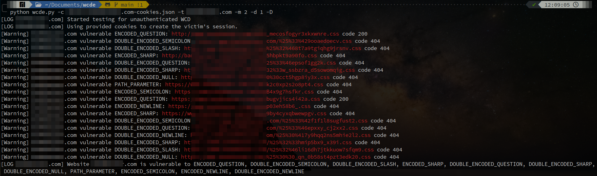

# Web Cache Deception Escalates

Python implementation of the Web Cache Deception detection methodology presented in the paper "Web Cache Deception Escalates!" published at USENIX Security '22: [Web Cache Deception Escalates](https://www.usenix.org/conference/usenixsecurity22/presentation/mirheidari).

Detect WCD vulnerabilities in websites in a black-box manner.

## Usage

### On a Single Target

```bash
usage: wcde.py -t example.com
```

For more information about the options, please see the help page.

### On a List of Targets

```help
usage: launcher.py -s sites.txt
```

For more information about the options, please see the help page.

### DE with Authentication

Requires an account to be manually created on the website so that the attack URL is requested with valid authentication cookies, simulating a logged-in victim clicking on the malicious link.

The JSON cookies file contains a list of cookies and can be generated using the browser extension Cookie-Editor for [Firefox](https://addons.mozilla.org/it/firefox/addon/cookie-editor/) or [Chrome](https://chrome.google.com/webstore/detail/cookie-editor/hlkenndednhfkekhgcdicdfddnkalmdm).

```help
usage: wcde.py -t example.com -c example.com-cookies.json
```

## Setup

```bash
pip install -r requirements.txt
```

## Screenshots

DE testing a vulnerable target with authentication.



## Notice

- The code is provided as-is and is not guaranteed to detect all WCD vulnerabilities.
  - If the script does not find any vulnerabilities, it does not necessarily mean that the website is not vulnerable.
- You should use this script only against websites that you own or control, or for which you have permission to perform security analysis.
